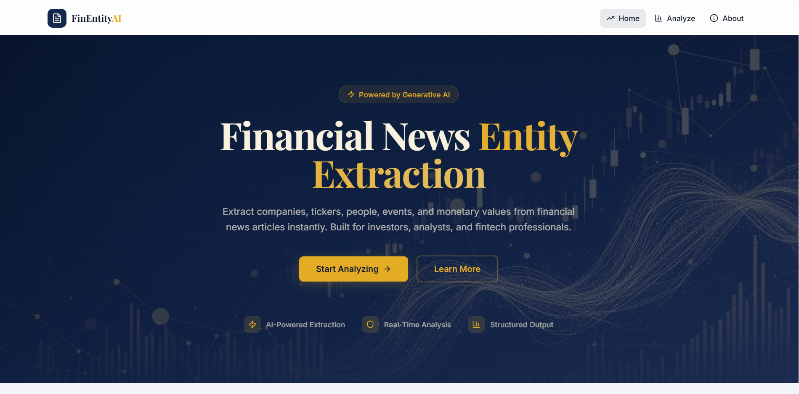
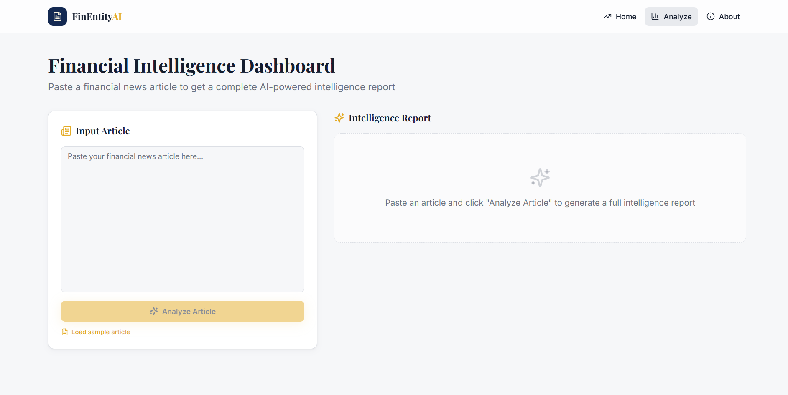
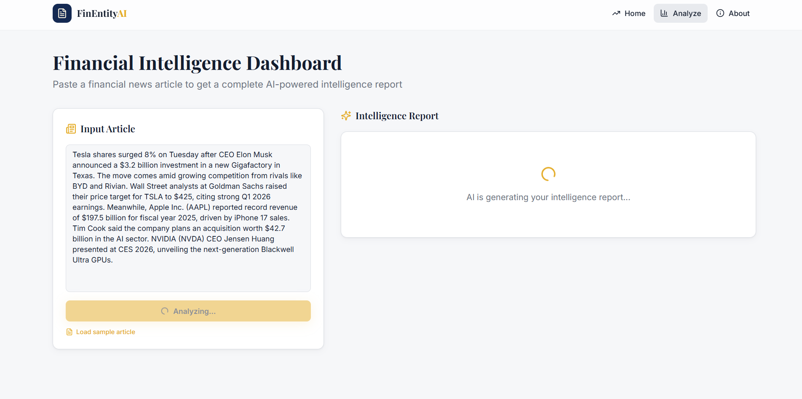
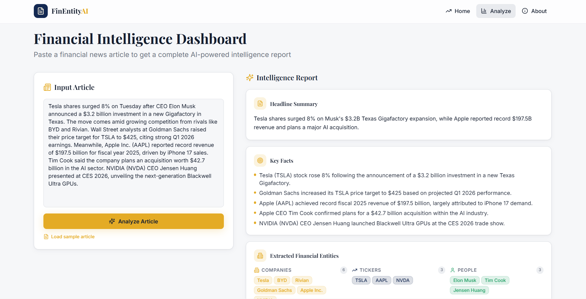
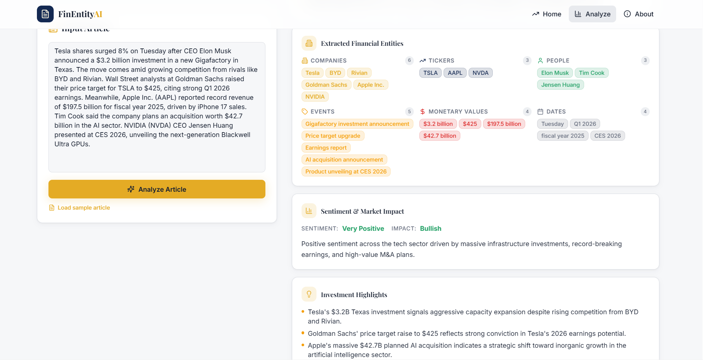
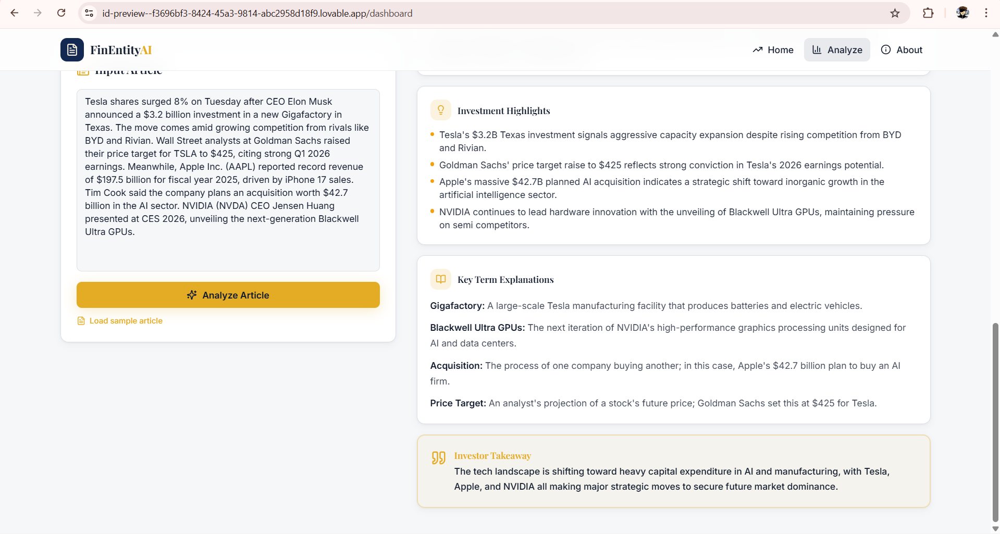
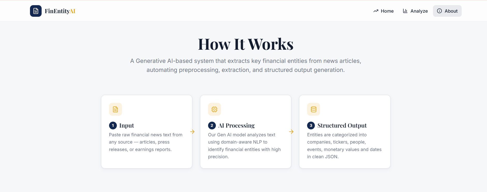
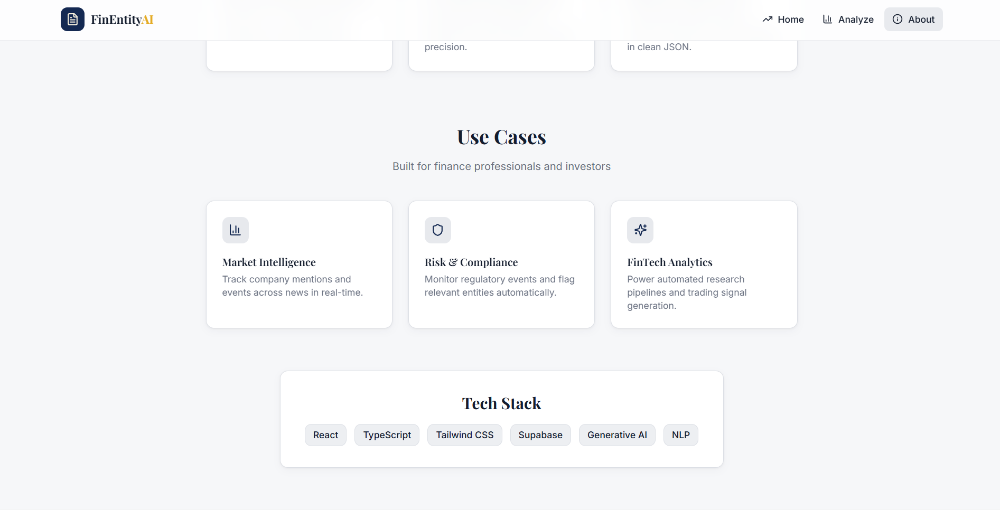

# FinEntityAI — Financial News Entity Extraction using Gen AI



**An AI-powered financial intelligence platform that extracts key entities, sentiment, and investment insights from news articles in seconds.**

[](https://react.dev/)
[](https://www.typescriptlang.org/)
[](https://tailwindcss.com/)
[](https://supabase.com/)
[](https://ai.google.dev/)

---

## 👤 Author

| Name | Role |
|------|------|
| **Ravi Chandra Sekhar Reddy** | Full Stack Developer |

---

## 📸 Screenshots

### Landing Page — Hero Section

*Professional navy/gold hero with animated financial chart background and CTA buttons*

### Analysis Dashboard — Empty State

*Clean input interface with article text area and intelligence report placeholder*

### Analysis Dashboard — Loading State

*Sample article loaded with AI generating the intelligence report in real-time*

### Intelligence Report — Summary & Key Facts

*Headline summary, key facts bullet points, and extracted financial entities with color-coded badges*

### Intelligence Report — Entities & Sentiment

*Companies, tickers, people, events, monetary values, dates extraction with sentiment & market impact analysis*

### Intelligence Report — Highlights & Takeaway

*Investment highlights, key term explanations, and the investor takeaway card*

### About — How It Works Pipeline

*3-step pipeline: Input → AI Processing → Structured Output*

### About — Use Cases & Tech Stack

*Market Intelligence, Risk & Compliance, FinTech Analytics use cases with tech stack badges*

---

## 🛠 Tech Stack

### Frontend
- **React 18** — Modern UI framework with hooks
- **TypeScript** — Type-safe development
- **Vite** — Lightning-fast build tool
- **Tailwind CSS** — Utility-first styling
- **shadcn/ui** — Beautiful component library
- **React Router v6** — Client-side routing
- **TanStack React Query** — Server state management
- **Lucide React** — Icon library

### Backend
- **Supabase** — PostgreSQL database & edge functions
- **Edge Functions** — Serverless backend logic (Deno runtime)
- **Google Gemini 3 Flash** — AI-powered entity extraction & analysis
- **Google Gemini API** — Secure AI model access

---

## 📁 Project Structure

```
finentity-ai/
├── src/
│   ├── components/
│   │   ├── AnalysisResults.tsx    # 7-section intelligence report display
│   │   ├── EntityResults.tsx      # Entity extraction visualization
│   │   ├── ExampleOutput.tsx      # Landing page showcase
│   │   ├── HeroSection.tsx        # Hero banner with CTA
│   │   ├── Navbar.tsx             # Navigation bar
│   │   ├── NavLink.tsx            # Navigation link component
│   │   └── ui/                    # shadcn components
│   ├── hooks/
│   │   ├── use-mobile.tsx         # Responsive breakpoint hook
│   │   └── use-toast.ts           # Toast notification hook
│   ├── pages/
│   │   ├── Index.tsx              # Landing page
│   │   ├── Dashboard.tsx          # Analysis dashboard
│   │   ├── About.tsx              # How it works & use cases
│   │   └── NotFound.tsx           # 404 page
│   ├── integrations/
│   │   └── supabase/
│   │       ├── client.ts          # Supabase client configuration
│   │       └── types.ts           # Auto-generated database types
│   ├── assets/
│   │   └── hero-bg.jpg            # Hero background image
│   └── index.css                  # Design system (navy/gold tokens)
├── supabase/
│   ├── functions/
│   │   └── extract-entities/      # AI extraction edge function
│   │       └── index.ts
│   └── config.toml                # Supabase configuration
├── docs/
│   └── screenshots/               # App screenshots for README
├── public/
│   ├── favicon.ico
│   └── robots.txt
├── tailwind.config.ts             # Tailwind with custom design tokens
├── index.html                     # Entry point with SEO meta tags
└── vite.config.ts                 # Vite build configuration
```

---

## 🚀 Getting Started

### Prerequisites
- Node.js 18+
- npm or bun
- Supabase account (free tier available)

### Step 1: Clone & Install

```bash
# Clone the repository
git clone https://github.com/RaviChandraSekharReddy/Financial-News-Entity-Extraction-using-Gen-AI.git
cd Financial-News-Entity-Extraction-using-Gen-AI

# Install dependencies
npm install
```

### Step 2: Set Up Supabase Backend

1. **Create a Supabase Project** at [supabase.com](https://supabase.com/)

2. **Configure environment variables** — Create a `.env` file:

```env
VITE_SUPABASE_URL=https://YOUR_PROJECT_ID.supabase.co
VITE_SUPABASE_PUBLISHABLE_KEY=your_anon_key_here
VITE_SUPABASE_PROJECT_ID=YOUR_PROJECT_ID
```

### Step 3: Deploy Edge Functions (AI Backend)

```bash
# Install Supabase CLI
npm install -g supabase

# Login to Supabase
supabase login

# Link your project
supabase link --project-ref YOUR_PROJECT_ID

# Add AI API secret
supabase secrets set GEMINI_API_KEY=your_gemini_api_key

# Deploy the extraction function
supabase functions deploy extract-entities
```

### Step 4: Run the Application

```bash
# Development mode
npm run dev

# Open http://localhost:8080 in your browser
```

### Step 5: Build for Production

```bash
# Create production build
npm run build

# Preview production build
npm run preview
```

---

## 🔗 Frontend-Backend Connection

### Architecture Overview

```
┌─────────────────────────────────────────────────────────────┐
│                        FRONTEND                              │
│  React + TypeScript + Tailwind + shadcn/ui                  │
│                                                              │
│  ┌──────────────┐  ┌──────────────┐  ┌──────────────┐       │
│  │   Pages      │  │  Components  │  │    Hooks     │       │
│  │  Index       │  │ AnalysisRes  │  │ use-mobile   │       │
│  │  Dashboard   │  │ EntityRes    │  │ use-toast    │       │
│  │  About       │  │ HeroSection  │  │              │       │
│  └──────┬───────┘  └──────────────┘  └──────┬───────┘       │
│         │                                    │               │
│         └──────────────┬─────────────────────┘               │
│                        │                                     │
│              ┌─────────▼─────────┐                          │
│              │  Supabase Client  │                          │
│              │  @supabase/js     │                          │
│              └─────────┬─────────┘                          │
└────────────────────────┼────────────────────────────────────┘
                         │ HTTPS
                         ▼
┌─────────────────────────────────────────────────────────────┐
│                        BACKEND                               │
│                   Supabase Cloud                             │
│                                                              │
│  ┌──────────────────────────────────────────────────────┐   │
│  │                   Edge Functions                      │   │
│  │  ┌──────────────────────────────────────────┐        │   │
│  │  │         extract-entities                  │        │   │
│  │  │  • Receives raw news article text         │        │   │
│  │  │  • Calls Google Gemini 3 Flash via        │        │   │
│  │  │    Gemini API with structured tool call   │        │   │
│  │  │  • Returns 7-section analysis JSON        │        │   │
│  │  └────────────────────┬──────────────────────┘        │   │
│  │                       │                                │   │
│  │                 ┌─────▼─────┐                          │   │
│  │                 │ Gemini API│                          │   │
│  │                 │ (Google)  │                          │   │
│  │                 └───────────┘                          │   │
│  └──────────────────────────────────────────────────────┘   │
└─────────────────────────────────────────────────────────────┘
```

### Data Flow

1. **User Input**: User pastes a financial news article into the Dashboard
2. **Edge Function**: Frontend calls `extract-entities` edge function via Supabase client
3. **AI Processing**: Edge function sends text to Google Gemini 3 Flash with structured tool calling schema
4. **Structured Output**: AI returns a 7-section analysis (headline, key facts, entities, sentiment, highlights, terms, takeaway)
5. **Display**: Frontend renders the structured analysis in a professional card-based layout

### Key Integration Points

| Frontend File | Backend Connection |
|---|---|
| `src/pages/Dashboard.tsx` | `extract-entities` edge function |
| `src/integrations/supabase/client.ts` | Supabase project configuration |

---

## 🔑 API Keys Required

| Service | Purpose | Where to Get |
|---------|---------|-------------|
| Supabase | Database, Edge Functions | [supabase.com](https://supabase.com/) |
| Google Gemini API | Gemini 3 Flash for entity extraction | [Google AI Studio](https://aistudio.google.com/) |

---

## 📋 Features

### Core Features
- ✅ **7-Section Financial Intelligence Report** — Comprehensive structured analysis
- ✅ **Entity Extraction** — Companies, tickers, people, events, monetary values, dates
- ✅ **Sentiment Analysis** — Overall sentiment + market impact scoring
- ✅ **Investment Highlights** — Opportunities, risks, affected sectors, red flags
- ✅ **Term Explanations** — Plain-English explanations of complex financial terms
- ✅ **Investor Takeaway** — Single most important insight per article
- ✅ **Sample Article** — One-click demo with pre-loaded financial news

### Technical Features
- ✅ Responsive design (mobile, tablet, desktop)
- ✅ Navy/Gold professional design system with light/dark mode support
- ✅ Serverless edge functions for AI processing
- ✅ Structured AI tool calling for reliable JSON output
- ✅ Error handling with rate limit and credit exhaustion feedback
- ✅ Type-safe API with TypeScript

---

## 🎨 Design System

The project uses a custom **navy/gold** corporate design system:

- **CSS Variables** for theming (light/dark mode)
- **Semantic color tokens** — primary (navy), accent (gold), success, warning
- **Custom typography** — Playfair Display (headings) + Inter (body)
- **Custom shadows** — card, elevated, gold glow effects
- **Gradient backgrounds** — Navy gradient hero, gold gradient accents

---

## 🧪 Testing

```bash
# Run unit tests
npm run test

# Run tests with coverage
npm run test:coverage
```

---

## 📝 Resume Points

**Technical Achievements:**
- Built a full-stack React application with TypeScript for financial intelligence
- Implemented AI-powered entity extraction using Google Gemini 3 Flash with structured tool calling
- Created serverless edge functions on Supabase for secure Gemini API integration
- Designed a custom navy/gold design system with semantic tokens and CSS variables
- Built a comprehensive 7-section financial analysis report generator
- Implemented structured AI output with JSON schema validation

**Skills Demonstrated:**
- React, TypeScript, Tailwind CSS
- Supabase, Edge Functions (Deno runtime)
- Generative AI integration (Gemini)
- NLP & Named Entity Recognition concepts
- REST API design & integration
- Responsive UI/UX design
- State management with React Query

---

## 📄 License

This project is licensed under the MIT License - see the [LICENSE](LICENSE) file for details.

---

**Built with ❤️ by Ravi Chandra Sekhar Reddy**

*FinEntityAI — Extract Intelligence from Financial News*
